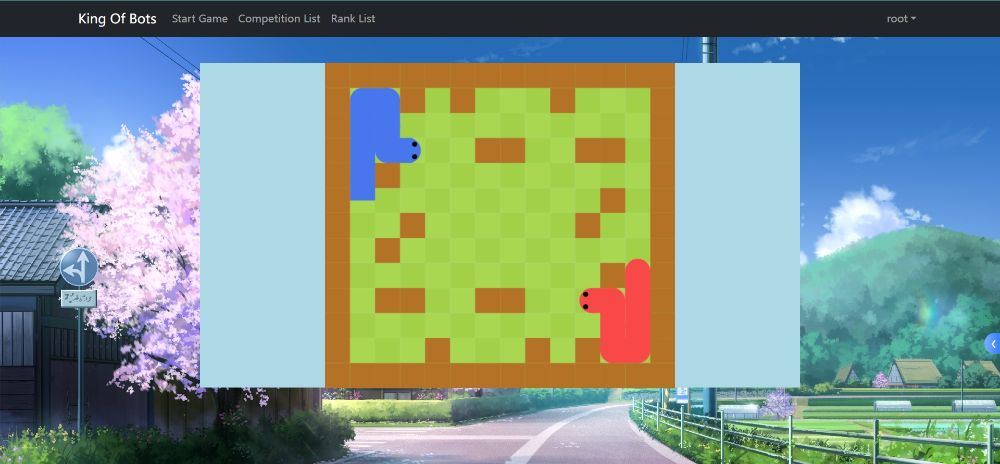

# King of Bots

****
来自y总的SpringBoot框架课, [https://www.acwing.com/activity/content/1877/](https://www.acwing.com/activity/content/1877/)

由于这门课比较早了, 一些SpringBoot的用法已经变了, 尤其是SecurityConfig部分, 我的配置是:

- java: 22

- spring-boot: 3.3.0

- 其他详见pom.xml
****

## 实现功能:
- 贪吃蛇游戏
- 可以设置Bot智能体代码, 代替人出战
- 按分值匹配用户/排行榜/登陆注册/竞赛回放功能

## 实现效果:

